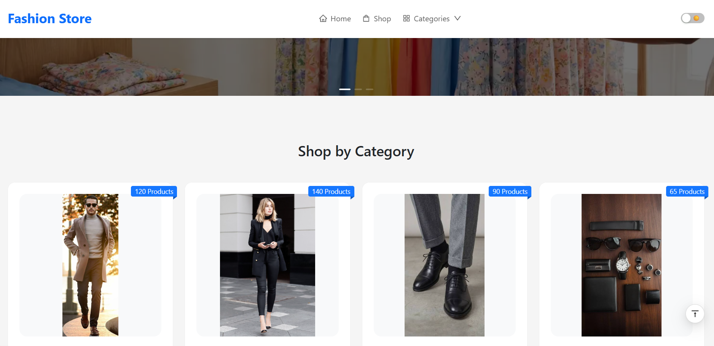
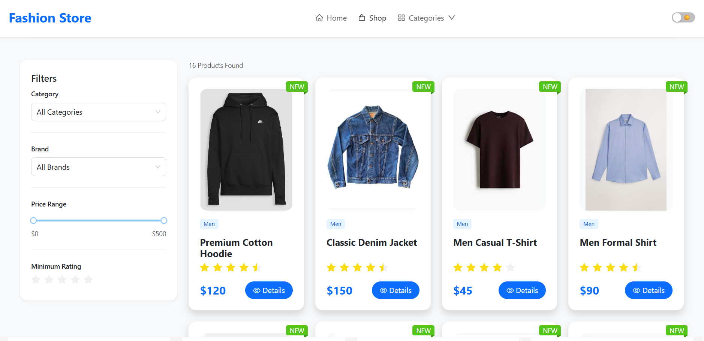
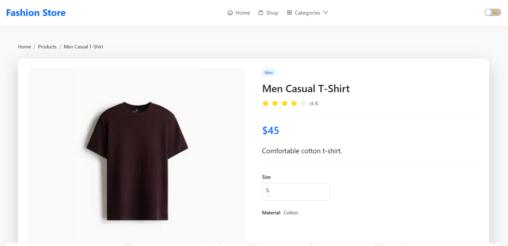
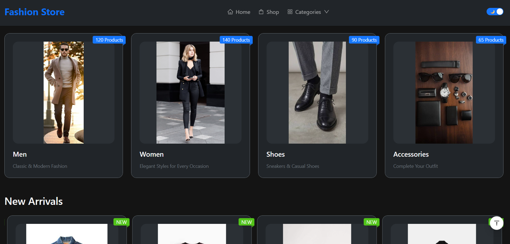

# 🛍️ Fashion Store

A modern and responsive e-commerce frontend built with **React + Vite**.

Fashion Store is a stylish online shopping interface that allows users to browse products, search, filter items, view product details, and switch between dark and light themes.

---

## 🌐 Live Demo

🚀 Check out the live version:

https://fashion-store-react-bootstrap-ant-d-vert.vercel.app/

---

## 📸 Preview

### Home Page




### Products Page




### Product Details




### Dark Mode



---

## ✨ Features

- ✅ Modern and responsive UI
- ✅ React + Vite architecture
- ✅ Dark / Light theme
- ✅ Product listing
- ✅ Product search
- ✅ Advanced filtering:
  - Category
  - Brand
  - Price range
  - Rating
- ✅ Product details page
- ✅ Related products section
- ✅ Product carousel
- ✅ Newsletter subscription
- ✅ Smooth scroll navigation
- ✅ Responsive navigation bar
- ✅ Mobile friendly layout

---

## 🛠️ Technologies

### Frontend

- React.js
- Vite
- JavaScript (ES6+)
- React Router DOM

### UI & Styling

- Ant Design
- Bootstrap
- CSS3

### Tools

- Git
- GitHub
- VS Code

---

## 📦 Main Libraries

### Ant Design

Used for:

- Cards
- Buttons
- Inputs
- Tabs
- Dropdowns
- Switch
- Rating
- Layout components


### Bootstrap

Used for:

- Responsive grid system
- Utility classes
- Spacing
- Layout design


### React Router DOM

Used for:

- Page navigation
- Product details routing
- Dynamic routes

---

## 🚀 Installation

Clone the repository:

```bash
git clone https://github.com/your-username/fashion-store.git
````

Go to project folder:

```bash
cd fashion-store
```

Install dependencies:

```bash
npm install
```

Run development server:

```bash
npm run dev
```

Open:

```text
http://localhost:5173
```

---

## 📁 Project Structure

```text
src
│
├── assets
│
├── components
│   ├── Navbar.jsx
│   ├── Footer.jsx
│   ├── Hero.jsx
│   ├── ProductCard.jsx
│   ├── ProductCarousel.jsx
│   ├── ProductFilter.jsx
│   ├── ProductTabs.jsx
│   ├── RelatedProducts.jsx
│   ├── SearchBar.jsx
│   ├── Newsletter.jsx
│   └── ScrollToTop.jsx
│
├── pages
│   ├── Home.jsx
│   ├── Products.jsx
│   ├── ProductDetails.jsx
│   └── NotFound.jsx
│
├── data
│   └── products.js
│
├── App.jsx
└── main.jsx
```

---

# 📄 Pages

## 🏠 Home Page

Includes:

* Hero section
* Categories
* New arrivals
* Best sellers
* Sale products
* Brand section
* Newsletter

---

## 🛒 Shop Page

Features:

* Product grid
* Search bar
* Category filter
* Brand filter
* Price filter
* Rating filter
* Responsive product cards

---

## 📦 Product Details Page

Includes:

* Product image
* Product information
* Price
* Rating
* Description
* Specifications
* Reviews
* Related products

---

## 🎨 Theme System

The application supports:

☀️ Light Mode

🌙 Dark Mode

Theme switching is implemented globally using:

* React State
* Ant Design ConfigProvider

---

## 📱 Responsive Design

The project is optimized for:

* Desktop
* Tablet
* Mobile

The layout automatically adapts to different screen sizes.

---

## 🔮 Future Improvements

* 🛒 Shopping cart
* ❤️ Wishlist
* 🔐 User authentication
* 💳 Payment integration
* 🔗 Backend API connection
* 📦 Order management
* ⭐ Product reviews system

---

## 👨‍💻 Author

**Mohammad Jm**

Frontend Developer

---

## ⭐ Support

If you like this project, please consider giving it a ⭐ on GitHub.


